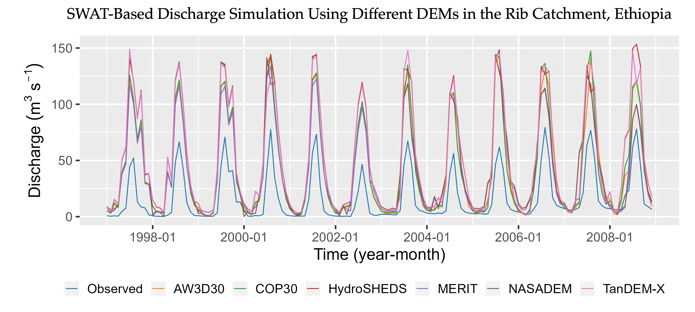

## How does the choice of DEMs affect catchment hydrological modeling?

Authors: Moges DM., Virro H., Kmoch A., Cibin R., Rohith A.N., Martínez-Salvador A., Conesa-García C., Uuemaa E.

## Abstract
The digital elevation models (DEMs) are the primary and most important spatial inputs for a wide range of hydrological applications. However, their availability from multiple sources and at various spatial resolutions poses a challenge in watershed modeling as they influence hydrological feature delineation and model simulations. In this study, we evaluated the effect of DEM choice on stream and catchment delineation and streamflow simulation using the SWAT model in four distinct geographic regions with diverse terrain surfaces. Performance evaluation metrics, including Willmott's index of agreement, and nRMSE combined with visual comparisons were employed to assess each DEM's performance. Our results revealed that the choice of DEM has a significant impact on the accuracy of stream and catchment delineation, while its influence on streamflow simulation within the same catchment was relatively minor. Among the evaluated DEMs, AW3D30 and COP30 performed the best, closely followed by MERIT, whereas TanDEM-X and HydroSHEDS exhibited poorer performance. All DEMs displayed better accuracy in mountainous and larger catchments compared to smaller and flatter catchments. Forest cover also played a role in accuracy, mainly due to its association with steep slopes. Our findings provide valuable insights for making informed data selection decisions in watershed modeling, considering the specific characteristics of the catchment and the desired level of accuracy.

## Acknowledgments
This work was funded by the Mobilitas+ program (grant no. MOBJD610 and MOBERC34), Estonian Research Agency grants no. PRG1764 and PSG841, and the European Regional Development Fund (EcolChange Centre of Excellence). We thank the scientific language editor Geoff Hart for improving the grammar and the readability of the paper.

Python scripts are available on project's github page: https://github.com/LandscapeGeoinformatics/dem_comparison

The full paper can be accessed at: https://doi.org/10.1016/j.scitotenv.2023.164627